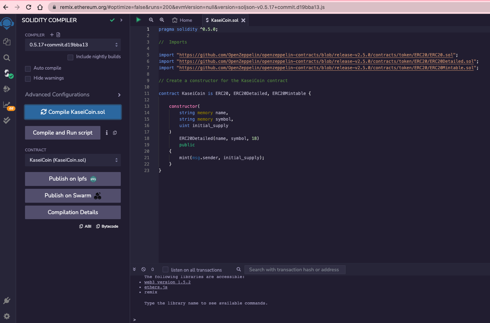
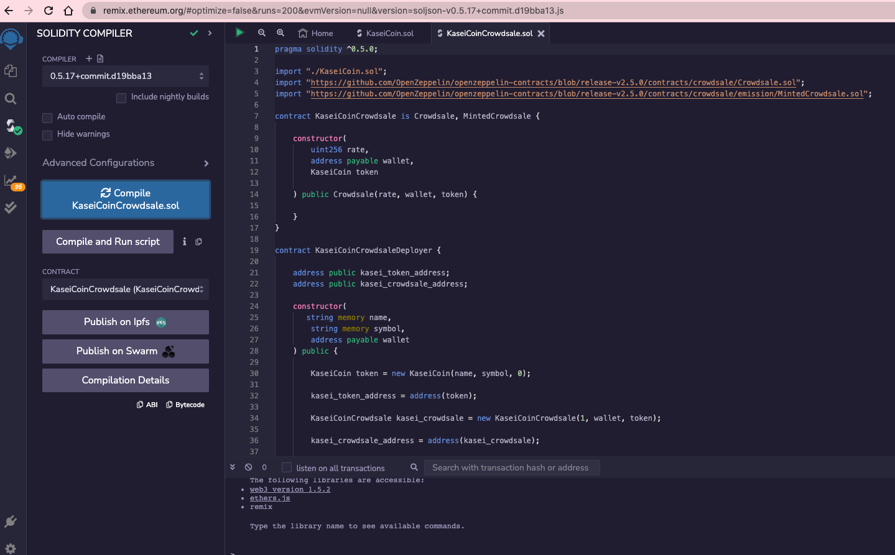

# Crowdsale Project

This application creates a new ERC-20 compliant token that can be minted via an OpenZeppelin smart contract.

## Installation

To install and use this application:

- Clone the this repository to your local machine.

```
git clone https://github.com/jgrichardson/KaseiCoin.git
```

- Upload the KaseiCoin.sol into Remix

- Compile the KaiseCoin smart contract

- Deploy the KaiseCoin smart contract to the Remix VM or to the Injected Provider Metamask.

- Use the "buy token" feature to purchase tokens

- Use the weiRaised, and TotalSupply functions to test the application

## Screenshots

### Compliation of Coin Contract



### Compilation of Crowdsale Contract



## License

The source code for the application is licensed under the MIT license, which you can find in the LICENSE file in this repo.
